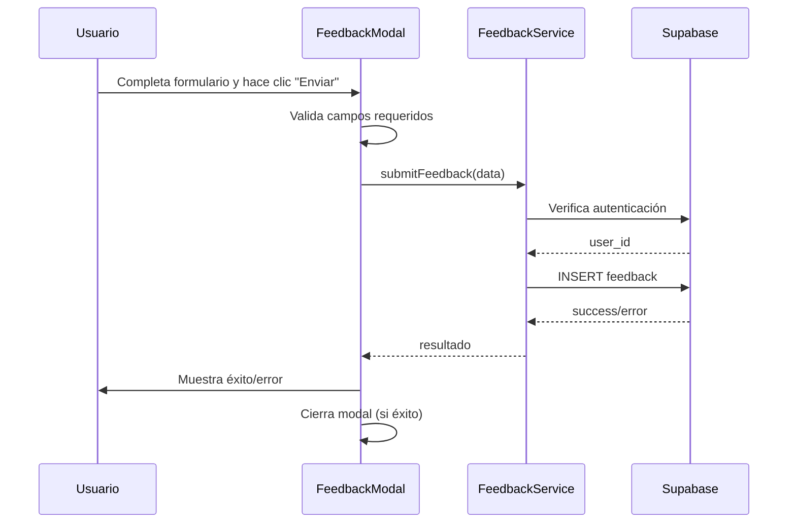

# Diseño Técnico - Feedback Backend Integration (Fase 2)

## Resumen

Este documento describe el diseño técnico para implementar la funcionalidad backend del sistema de feedback de CrossFit Tracker. El enfoque es simple y directo: permitir que los usuarios envíen feedback real que se almacene en Supabase asociado a su cuenta.

## Arquitectura

### Diagrama de Flujo



### Componentes Afectados

1. **FeedbackModal** (modificación): Agregar lógica de envío real
2. **FeedbackService** (nuevo): Servicio para comunicación con Supabase
3. **Database Schema** (nuevo): Tabla simple para almacenar feedback

## Base de Datos

### Tabla: `feedback`

```sql
CREATE TABLE feedback (
  id UUID DEFAULT gen_random_uuid() PRIMARY KEY,
  user_id UUID REFERENCES auth.users(id) ON DELETE CASCADE NOT NULL,
  type TEXT NOT NULL CHECK (type IN ('bug', 'improvement', 'feature')),
  title TEXT NOT NULL,
  description TEXT NOT NULL,
  created_at TIMESTAMP WITH TIME ZONE DEFAULT NOW()
);
```

### Row Level Security (RLS)

```sql
-- Habilitar RLS
ALTER TABLE feedback ENABLE ROW LEVEL SECURITY;

-- Política para insertar: usuarios pueden insertar su propio feedback
CREATE POLICY "Users can insert own feedback" ON feedback
  FOR INSERT WITH CHECK (auth.uid() = user_id);

-- Política para leer: solo admins pueden leer (para futuro admin panel)
CREATE POLICY "Admins can read all feedback" ON feedback
  FOR SELECT USING (
    EXISTS (
      SELECT 1 FROM auth.users 
      WHERE auth.users.id = auth.uid() 
      AND auth.users.email = 'admin@crossfit-tracker.com'
    )
  );
```

### Índices

```sql
-- Índice para consultas por usuario
CREATE INDEX idx_feedback_user_id ON feedback(user_id);

-- Índice para consultas por fecha
CREATE INDEX idx_feedback_created_at ON feedback(created_at DESC);
```

## Servicios

### FeedbackService

**Archivo:** `services/feedbackService.ts`

```typescript
import { createClient } from '@/utils/supabase/client'

export interface FeedbackData {
  type: 'bug' | 'improvement' | 'feature'
  title: string
  description: string
}

export interface FeedbackResult {
  success: boolean
  error?: string
  data?: any
}

export async function submitFeedback(data: FeedbackData): Promise<FeedbackResult> {
  try {
    const supabase = createClient()
    
    // Verificar autenticación
    const { data: { user }, error: authError } = await supabase.auth.getUser()
    if (authError || !user) {
      return { success: false, error: 'Debes iniciar sesión para enviar feedback' }
    }

    // Validar datos
    if (!data.description.trim()) {
      return { success: false, error: 'La descripción es requerida' }
    }

    // Insertar feedback
    const { data: feedback, error } = await supabase
      .from('feedback')
      .insert({
        user_id: user.id,
        type: data.type,
        title: data.title.trim(),
        description: data.description.trim()
      })
      .select()
      .single()

    if (error) {
      console.error('Error inserting feedback:', error)
      return { success: false, error: 'Error al enviar feedback. Inténtalo de nuevo.' }
    }

    return { success: true, data: feedback }
  } catch (error) {
    console.error('Unexpected error in submitFeedback:', error)
    return { success: false, error: 'Error inesperado. Inténtalo de nuevo.' }
  }
}
```

## Modificaciones de Componentes

### FeedbackModal - Estados

```typescript
// Nuevos estados para el modal
const [isSubmitting, setIsSubmitting] = useState(false)
const [submitStatus, setSubmitStatus] = useState<'idle' | 'success' | 'error'>('idle')
const [submitMessage, setSubmitMessage] = useState('')
```

### FeedbackModal - Función de Envío

```typescript
const handleSubmit = async () => {
  // Validación local
  if (!formData.description.trim()) {
    setErrors({ description: 'La descripción es requerida' })
    return
  }

  setIsSubmitting(true)
  setSubmitStatus('idle')
  setErrors({})

  try {
    const result = await submitFeedback(formData)
    
    if (result.success) {
      setSubmitStatus('success')
      setSubmitMessage('¡Feedback enviado!')
      
      // Cerrar modal después de 2 segundos
      setTimeout(() => {
        onClose()
        setSubmitStatus('idle')
        setSubmitMessage('')
        // Reset form
        setFormData({ type: 'bug', title: '', description: '' })
      }, 2000)
    } else {
      setSubmitStatus('error')
      setSubmitMessage(result.error || 'Error al enviar')
    }
  } catch (error) {
    setSubmitStatus('error')
    setSubmitMessage('Error inesperado')
  } finally {
    setIsSubmitting(false)
  }
}
```

### FeedbackModal - Botón de Envío

```typescript
<button
  type="button"
  onClick={handleSubmit}
  disabled={isSubmitting || !user}
  className={`
    w-full px-4 py-2 rounded-md font-medium min-h-[44px] flex items-center justify-center
    ${isSubmitting || !user
      ? 'bg-gray-300 text-gray-500 cursor-not-allowed'
      : 'bg-blue-600 text-white hover:bg-blue-700 focus:outline-none focus:ring-2 focus:ring-blue-500'
    }
  `}
>
  {isSubmitting ? (
    <>
      <svg className="animate-spin -ml-1 mr-3 h-5 w-5 text-white" xmlns="http://www.w3.org/2000/svg" fill="none" viewBox="0 0 24 24">
        <circle className="opacity-25" cx="12" cy="12" r="10" stroke="currentColor" strokeWidth="4"></circle>
        <path className="opacity-75" fill="currentColor" d="M4 12a8 8 0 018-8V0C5.373 0 0 5.373 0 12h4zm2 5.291A7.962 7.962 0 014 12H0c0 3.042 1.135 5.824 3 7.938l3-2.647z"></path>
      </svg>
      Enviando...
    </>
  ) : submitStatus === 'success' ? (
    <>
      <svg className="w-5 h-5 mr-2" fill="currentColor" viewBox="0 0 20 20">
        <path fillRule="evenodd" d="M16.707 5.293a1 1 0 010 1.414l-8 8a1 1 0 01-1.414 0l-4-4a1 1 0 011.414-1.414L8 12.586l7.293-7.293a1 1 0 011.414 0z" clipRule="evenodd" />
      </svg>
      ¡Enviado!
    </>
  ) : submitStatus === 'error' ? (
    <>
      <svg className="w-5 h-5 mr-2" fill="currentColor" viewBox="0 0 20 20">
        <path fillRule="evenodd" d="M18 10a8 8 0 11-16 0 8 8 0 0116 0zm-7 4a1 1 0 11-2 0 1 1 0 012 0zm-1-9a1 1 0 00-1 1v4a1 1 0 102 0V6a1 1 0 00-1-1z" clipRule="evenodd" />
      </svg>
      Error
    </>
  ) : !user ? (
    'Inicia sesión para enviar'
  ) : (
    'Enviar Feedback'
  )}
</button>
```

### Mensaje de Estado

```typescript
{submitMessage && (
  <div className={`mt-3 p-3 rounded-lg text-sm ${
    submitStatus === 'success' 
      ? 'bg-green-50 text-green-800 border border-green-200' 
      : 'bg-red-50 text-red-800 border border-red-200'
  }`}>
    {submitMessage}
  </div>
)}
```

## Manejo de Errores

### Tipos de Error

1. **No autenticado**: "Debes iniciar sesión para enviar feedback"
2. **Validación**: "La descripción es requerida"
3. **Error de red**: "Error al enviar feedback. Inténtalo de nuevo."
4. **Error inesperado**: "Error inesperado. Inténtalo de nuevo."

### Logging

```typescript
// Solo logging básico en consola para debugging
console.error('Error inserting feedback:', error)
console.error('Unexpected error in submitFeedback:', error)
```

## Testing

### Tests del Service

**Archivo:** `__tests__/services/feedbackService.test.ts`

```typescript
describe('FeedbackService', () => {
  it('should submit feedback successfully', async () => {
    // Mock Supabase success response
    // Test successful submission
  })

  it('should handle unauthenticated user', async () => {
    // Mock no user
    // Test error response
  })

  it('should handle validation errors', async () => {
    // Test empty description
    // Test error response
  })

  it('should handle database errors', async () => {
    // Mock Supabase error
    // Test error handling
  })
})
```

### Tests del Modal

**Archivo:** `__tests__/components/feedback/FeedbackModal.integration.test.tsx`

```typescript
describe('FeedbackModal Integration', () => {
  it('should submit feedback and show success', async () => {
    // Mock successful service call
    // Test UI states during submission
  })

  it('should show error on submission failure', async () => {
    // Mock failed service call
    // Test error display
  })

  it('should disable form during submission', async () => {
    // Test loading states
  })
})
```

## Migración

### Pasos de Implementación

1. **Crear tabla en Supabase**
   - Ejecutar SQL de creación de tabla
   - Configurar RLS policies
   - Crear índices

2. **Implementar FeedbackService**
   - Crear archivo de servicio
   - Implementar función submitFeedback
   - Agregar tests unitarios

3. **Modificar FeedbackModal**
   - Agregar estados de envío
   - Implementar función handleSubmit
   - Actualizar UI del botón
   - Agregar mensaje de estado

4. **Testing**
   - Tests unitarios del service
   - Tests de integración del modal
   - Verificar que tests existentes sigan pasando

5. **Verificación**
   - Probar envío exitoso
   - Probar manejo de errores
   - Verificar datos en Supabase

## Consideraciones de Seguridad

1. **RLS**: Solo usuarios autenticados pueden insertar su propio feedback
2. **Validación**: Validación tanto en cliente como en servidor (RLS)
3. **Sanitización**: Supabase maneja automáticamente la sanitización SQL
4. **Rate Limiting**: Implementado a nivel de Supabase (límites por defecto)

## Performance

1. **Timeout**: Supabase maneja timeouts automáticamente
2. **Retry**: Usuario puede reintentar manualmente
3. **Optimistic UI**: No implementado (mantener simplicidad)
4. **Caching**: No necesario para esta funcionalidad

## Extensibilidad Futura

La implementación actual permite fácilmente:

1. **Admin Panel**: Ya tenemos RLS policy para admins
2. **Estados**: Agregar columna `status` a la tabla
3. **Respuestas**: Agregar tabla `feedback_responses`
4. **Metadata**: Agregar columna `metadata` JSONB
5. **Notificaciones**: Integrar con sistema de notificaciones

El diseño simple actual no requiere refactoring para estas extensiones futuras.