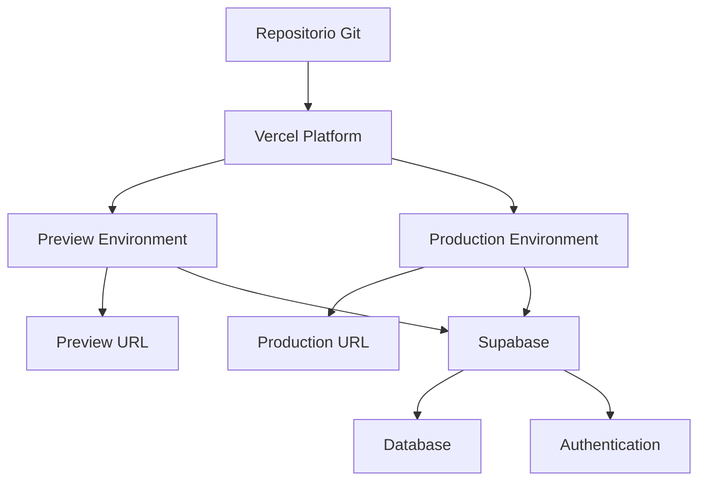
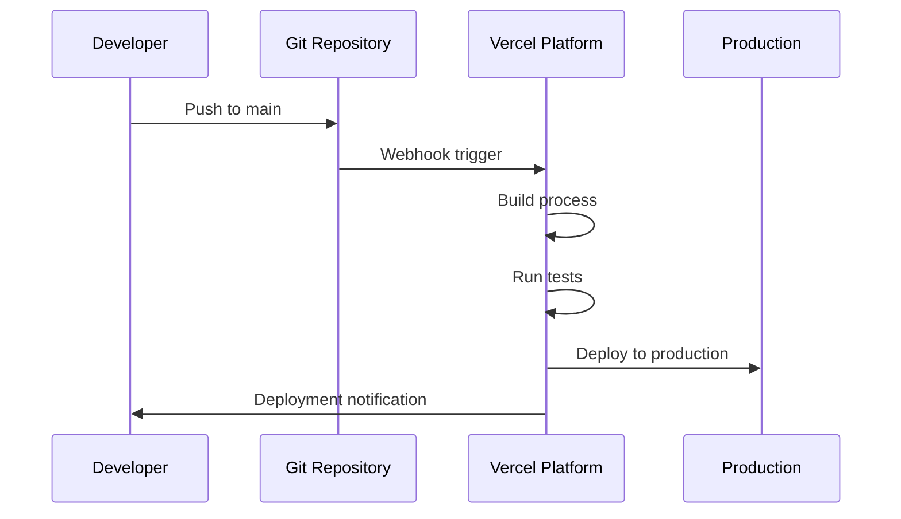

# Documento de Diseño - Despliegue en Vercel

## Introducción

Este documento describe el diseño técnico para desplegar la aplicación CrossFit Tracker en Vercel, incluyendo la arquitectura de despliegue, configuración de entorno, estrategias de CI/CD y procedimientos de verificación y rollback.

## Arquitectura de Despliegue

### Plataforma de Hosting
- **Proveedor**: Vercel
- **Framework**: Next.js 14 con App Router
- **Tipo de Despliegue**: Serverless Functions + Static Site Generation
- **CDN**: Global Edge Network de Vercel

### Estructura de Entornos



### Configuración de Build

**Build Settings:**
- Build Command: `npm run build`
- Output Directory: `.next`
- Install Command: `npm install`
- Node.js Version: 18.x (LTS)

**Framework Detection:**
- Vercel detectará automáticamente Next.js
- Configuración optimizada para App Router
- Soporte nativo para TypeScript

## Componentes y Interfaces

### 1. Configuración de Variables de Entorno

**Variables Requeridas:**
```bash
NEXT_PUBLIC_SUPABASE_URL=https://[project-ref].supabase.co
NEXT_PUBLIC_SUPABASE_ANON_KEY=[anon-key]
SUPABASE_ACCESS_TOKEN=[access-token] # Para MCP (opcional)
```

**Configuración en Vercel:**
- Variables configuradas a nivel de proyecto
- Aplicadas a entornos Production y Preview
- Encriptadas en reposo
- Límite: 64KB total por deployment

### 2. Integración Git

**Configuración del Repositorio:**
- Conexión automática con GitHub/GitLab/Bitbucket
- Branch de producción: `main`
- Auto-deployment habilitado
- Preview deployments para PRs

**Workflow de Despliegue:**


### 3. Configuración de Build Optimizada

**next.config.js Optimizations:**
- PWA support con next-pwa
- Bundle splitting para Supabase
- Image optimization
- Compiler optimizations para producción
- Cache strategies para recursos estáticos

**vercel.json Configuration:**
- Security headers (XSS, CSRF protection)
- Cache control para PWA assets
- Function timeout: 10 segundos
- CORS configuration para API routes

### 4. Monitoreo y Performance

**Métricas de Performance:**
- Core Web Vitals tracking
- Bundle size analysis
- Lighthouse CI integration
- Real User Monitoring (RUM)

**Targets de Performance:**
- First Contentful Paint: < 1.5s
- Largest Contentful Paint: < 2.5s
- Cumulative Layout Shift: < 0.1
- Time to Interactive: < 3s

## Modelos de Datos

### Configuración de Deployment

```typescript
interface DeploymentConfig {
  projectName: string;
  framework: 'nextjs';
  buildCommand: string;
  outputDirectory: string;
  environmentVariables: EnvironmentVariable[];
  domains: Domain[];
}

interface EnvironmentVariable {
  key: string;
  value: string;
  target: ('production' | 'preview' | 'development')[];
  type: 'encrypted' | 'plain';
}

interface Domain {
  name: string;
  verified: boolean;
  primary: boolean;
}
```

### Estado de Deployment

```typescript
interface DeploymentStatus {
  id: string;
  url: string;
  state: 'BUILDING' | 'READY' | 'ERROR' | 'CANCELED';
  createdAt: Date;
  buildTime: number;
  source: {
    type: 'git';
    ref: string;
    sha: string;
  };
}
```

## Manejo de Errores

### Estrategias de Error Handling

**Build Errors:**
- TypeScript compilation errors
- ESLint violations
- Test failures
- Dependency resolution issues

**Runtime Errors:**
- 500 error pages personalizadas
- Error boundary components
- Logging con Vercel Analytics
- Alertas automáticas

**Rollback Procedures:**
```bash
# Rollback inmediato usando Vercel CLI
vercel rollback [deployment-url]

# Rollback a deployment específico
vercel rollback --target production [deployment-id]

# Verificar estado después del rollback
vercel ls --meta
```

### Error Recovery

**Automatic Recovery:**
- Health checks automáticos
- Retry logic para requests fallidos
- Circuit breaker patterns
- Graceful degradation

**Manual Recovery:**
- Procedimientos de diagnóstico
- Logs centralizados
- Métricas de sistema
- Escalation procedures

## Estrategia de Testing

### Pre-deployment Testing

**Automated Testing Pipeline:**
```bash
# Verificación completa antes del deploy
npm run deploy:check

# Incluye:
# - Type checking (tsc --noEmit)
# - Linting (eslint)
# - Unit tests (jest)
# - Build verification
```

**Testing Environments:**
- **Preview**: Testing automático en cada PR
- **Staging**: Manual testing antes de producción
- **Production**: Smoke tests post-deployment

### Post-deployment Verification

**Automated Checks:**
- Health endpoint monitoring
- Core functionality verification
- Performance benchmarks
- Security scans

**Manual Testing Checklist:**
- [ ] Login/Registration flow
- [ ] Workout registration
- [ ] Records visualization
- [ ] Mobile responsiveness
- [ ] PWA functionality

### Performance Testing

**Lighthouse CI:**
```bash
# Performance audit automático
npm run performance:audit

# Genera reporte HTML
# Verifica Core Web Vitals
# Compara con baseline
```

**Load Testing:**
- Concurrent user simulation
- Database connection pooling
- API response times
- CDN cache effectiveness

## Seguridad

### Security Headers

**Implemented Headers:**
```javascript
{
  "X-Content-Type-Options": "nosniff",
  "X-Frame-Options": "DENY", 
  "X-XSS-Protection": "1; mode=block",
  "Referrer-Policy": "strict-origin-when-cross-origin"
}
```

### Environment Security

**Best Practices:**
- Variables de entorno encriptadas
- Secrets rotation procedures
- Access control por equipo
- Audit logs habilitados

### Application Security

**Supabase Integration:**
- Row Level Security (RLS) policies
- JWT token validation
- API rate limiting
- CORS configuration

## Procedimientos de Rollback

### Rollback Inmediato

**Vercel CLI Method:**
```bash
# 1. Identificar deployment anterior
vercel ls --meta

# 2. Rollback a deployment específico
vercel rollback [previous-deployment-url]

# 3. Verificar rollback exitoso
curl -I https://crossfit-tracker.vercel.app
```

**Dashboard Method:**
1. Acceder a Vercel Dashboard
2. Seleccionar proyecto CrossFit Tracker
3. Ir a Deployments tab
4. Seleccionar deployment anterior estable
5. Click "Promote to Production"

### Database Rollback

**Supabase Considerations:**
- Schema migrations no se revierten automáticamente
- Backup de datos antes de deployments críticos
- Procedimientos de data migration rollback
- Coordination entre app y database versions

### Verification Post-Rollback

**Health Checks:**
```bash
# Verificar aplicación funcionando
curl https://crossfit-tracker.vercel.app/api/health

# Verificar autenticación
curl https://crossfit-tracker.vercel.app/login

# Verificar funcionalidad core
npm run verify:production
```

## Monitoreo y Observabilidad

### Métricas de Sistema

**Vercel Analytics:**
- Page views y unique visitors
- Performance metrics
- Error rates
- Geographic distribution

**Custom Metrics:**
- User registration rates
- Workout submission success
- API response times
- Database query performance

### Alerting

**Alert Conditions:**
- Error rate > 5%
- Response time > 3s
- Build failures
- Deployment failures

**Notification Channels:**
- Email notifications
- Slack integration
- Dashboard alerts
- Mobile push notifications

### Logging

**Structured Logging:**
```typescript
// Production logging strategy
const logger = {
  info: (message: string, meta?: object) => {
    console.log(JSON.stringify({
      level: 'info',
      message,
      timestamp: new Date().toISOString(),
      ...meta
    }));
  },
  error: (message: string, error?: Error, meta?: object) => {
    console.error(JSON.stringify({
      level: 'error',
      message,
      error: error?.stack,
      timestamp: new Date().toISOString(),
      ...meta
    }));
  }
};
```

## Optimizaciones de Performance

### Bundle Optimization

**Code Splitting:**
- Automatic route-based splitting
- Dynamic imports para componentes pesados
- Vendor chunk separation
- Supabase client optimization

**Asset Optimization:**
- Image optimization con Next.js
- Font optimization
- CSS minification
- JavaScript compression

### Caching Strategy

**Static Assets:**
- CDN caching con headers apropiados
- Service Worker caching (PWA)
- Browser caching optimization
- Cache invalidation strategies

**API Caching:**
- Supabase query caching
- Edge caching para datos estáticos
- Cache warming strategies
- Cache invalidation on updates

### Progressive Web App

**PWA Features:**
- Service Worker registration
- Offline functionality
- App manifest configuration
- Push notifications ready
- Install prompts

**Cache Strategies:**
```javascript
// Runtime caching configuration
{
  urlPattern: /^https:\/\/.*\.supabase\.co\/.*/i,
  handler: 'NetworkFirst',
  options: {
    cacheName: 'supabase-api',
    expiration: {
      maxEntries: 50,
      maxAgeSeconds: 5 * 60 // 5 minutes
    }
  }
}
```